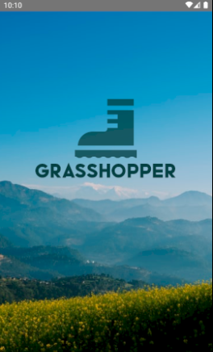
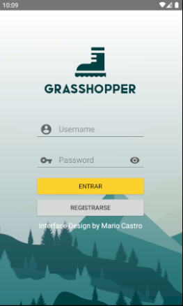

# Interface Design -  First
## Mario Castro Vélez

Este proyecto es el primer tutorial que hemos seguido para aprender diseño de interfaces en
Android Studio. Considero que la mejor forma de explicar su proceso de creación consiste en
seguir la división interna del proyecto, que ha sido también el flujo de aprendizaje. 
Aquí podemos ver la **estructura del proyecto**.

0. [Introducción]
Me ha parecido interesante escoger una gama de colores azulados, con destacados amarillos y
vivos en una temática que se puede asociar rápidamente con una aplicación de senderismo o de
temática campestre. Colores fríos con imágenes de paisajes que recuerden a la montaña.

El logo y el nombre de la aplicación afirman y apuntalan esta idea: una bota en svg como logo
y de nombre "Grasshopper", o saltamontes en español.

1. [Manifest]
En el AndroidManifest, documento xml, es en el lugar en el que declaramos la existencia de 
Activities y decidimos por cuál de ellas va a comenzar la aplicación al abrirse. Desde ahí
dirigimos el flujo de la aplicación.

2. [Java y Res: Layout]
En la carpeta de Java tenemos el desarrollo por programación de las activities. Tenemos la
**Splash Screen**, que es la ventana de recibimiento con el logo y una imagen de la montaña.

Desde la Splash Screen se accede automáticamente al **Login**, organizado de forma clásica con 
un espacio para el nombre de usuario y uno para la contraseña.

Desde el Login podemos acceder al **Signup** mediante el botón de Registrarse. La pantalla de 
registro es similar a la del login pero con los espacios necesarios (EditText) para introducir
datos de registro. 

Una vez realizado el log in, accedemos al Main, donde estaría desarrollada la aplicación, en 
este caso una app hipotética.

3. [Resources]
    3.1. [Layout]
        En el Layout encontramos lo que probablemente sea la parte más importante del desarrollo
        de interfaces: los xml donde decidimos qué objetos vemos, su jerarquía, cómo se llaman
        para su desarrollo en el código, su aspecto y apariencia, etc. Aquí, cada xml es un
        activity.
    3.2. [Drawable y mipmap]
        En estas carpetas encontramos las imágenes y los diseños vectoriales que se utilizan en
        nuestra aplicación, tanto en el logo como en las activities.
    3.3. [Añadidos]
        Podemos crear carpetas de recursos nuevas para añadir algunos detalles personalizados, 
        como es el caso de las fuentes nuevas (font de tipo font) o el caso de las animaciones
        (anim/anim).        
