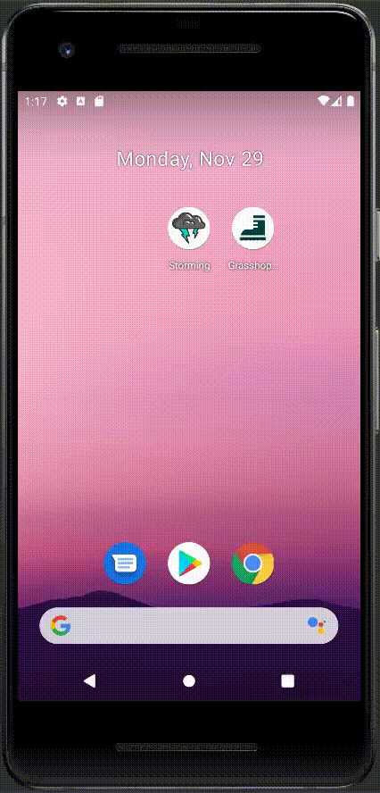

# Interface Design -  First
## Mario Castro

Este proyecto es el primer tutorial que hemos seguido para aprender diseño de interfaces en
Android Studio. Probablemente la mejor forma de explicar su proceso de creación consista en
seguir la división interna del proyecto.

En la siguiente imagen podemos ver la **estructura del proyecto**.

## *Introducción*
*Grasshopper* simula una aplicación de rutas y senderismo, similar en su concepción a algunos ejemplos reales como Wikiloc.
Sin romper con la temática agreste pero huyendo del cliché del color verde para temas naturales, me ha parecido interesante escoger una gama cromática de colores azulados, con destacados de un amarillo vivo que se pueden asociar rápidamente con la alta montaña gracias a la imagen de fondo de la aplicación y al splash screen.

En este caso, los colores fríos resultan menos agresivos y son ideales para ocupar los espacios principales de la aplicación.

El logo y el nombre de la aplicación son explícitos en cuanto a la temática: una bota de montaña como logo
y de nombre "Grasshopper" (saltamontes).

En el siguiente gif podemos ver la ejecución de la aplicación desde que la abrimos hasta que agotamos su actual desarrollo.

## 1. *Android Manifest*
El documento xml *AndroidManifest*, uno de los ejes fundamentales de cualquier aplicación *android*, es el lugar en el que declaramos la existencia de *Activities* y decidimos cuál de ellas va a iniciar la aplicación. Desde ahí
dirigimos el flujo del programa.

## 2. *Java* y *Res*: *Layout*
En la carpeta Java podemos encontrar las clases en las que programamos las tareas de las ventanas.

Lo primero que nos encontramos es la *Splash Screen*, que es la ventana de recibimiento con el logo y una imagen de montañas, que va a marcar  las directrices cromáticas    del resto de la aplicación.
La siguiente imagen sirve para identificar los colores principales de la app en función a la splash screen.

Desde la Splash Screen se accede automáticamente al **Login**, organizado de forma clásica con 
un espacio para el nombre de usuario y uno para la contraseña.

Desde el Login podemos acceder al **Signup** mediante el botón de Registrarse. La pantalla de 
registro es similar a la del login pero con los espacios necesarios (EditText) para introducir
datos del registro.

Una vez el usuario accede a su cuenta pasamos a la *Main Activity*, donde estaría desarrollada la aplicación, en
este caso algo sin relación: una recarga constante de un *WebView* con imágenes de obras de arte autogeneradas.

## 3. *Resources*
Dentro de la carpeta *res* nos encontramos con, como su propio nombre indica, los recursos necesarios para el funcionamiento de la aplicación organizados en directorios y archivos xml. Cada uno de estos se encarga de diversas funciones que pueden ser añadidas y mejoradas.
### 3.1. *Layout*
En el Layout encontramos lo que probablemente sea la parte más importante del desarrollo de interfaces: los xml donde decidimos qué objetos vemos, su jerarquía, cómo se llaman para su desarrollo en el código, su aspecto y apariencia, etc. Aquí, cada xml es un activity.
### 3.2. *Drawable* y *mipmap*
En estas carpetas encontramos las imágenes y los diseños vectoriales que se utilizan en nuestra aplicación, tanto en el logo como en las activities. En nuestro caso, por ejemplo, podemos encontrar los iconos con los svg del logo de la bota en mipmap y el propio logo en drawable.
### 3.3. Añadidos
Para muchas funcionalidades, Android Studio necesita que creemos nuevas carpetas de recursos. En nuestro caso hemos añadido fuentes personalizadas y, por tanto, hemos creado una carpeta llamada **font** de tipo *font*. También es el caso de las animaciones (anim/anim).

El añadido de mayor importancia es la carpeta *menu*, con los archivos menu_appbar.xml y menu_context.xml. La *appbar* es la barra superior en la que nos encontramos con diferentes acciones, como por ejemplo el icono de favorito o de búsqueda. En cada elemento podemos seleccionar si deseamos que se muestr completamente, siempre o nunca (en cuyo caso apareceran tres puntos que nos permitirán acceder a un desplegable). El *context menu* es el menú que aparece al mantener pulsado sobre el elemento que queremos desarrollar.

Todo esto se muestra en el gif de la introducción.

## 4. *Programación*
